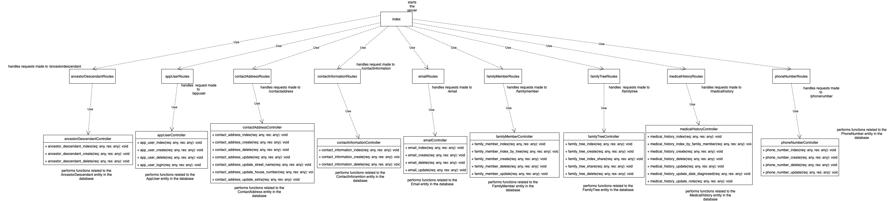

# Family Tree Backend
Backend for the family tree project. For more detailed information about the project, be sure to check out the frontend repository!
## Purpose 
- To host the backend services for the [Family Tree Project](https://github.com/acomanzo/family_tree). 
- To gain experience using Docker
- To gain experience using Microsoft SQL Server 
## Setup
### Database 
I have a Docker container that holds an image of sql server that's on localhost. 
### Server
The server is a REST API that interacts with the database based on the request it receives and then sends the client a response.  
## Future Goals
Find a free way to host this thing!
## Technologies Used
- Programming Languages: Javascript, SQL
- SQL Dialect: MS SQL Server 
- Runtime: Node.js
- Libraries: Express.js, 
- Hosting: Docker
## Software Used
- Visual Studio Code
- Azure Data Studio
- StarUML
- Draw.io
## Class Diagram
